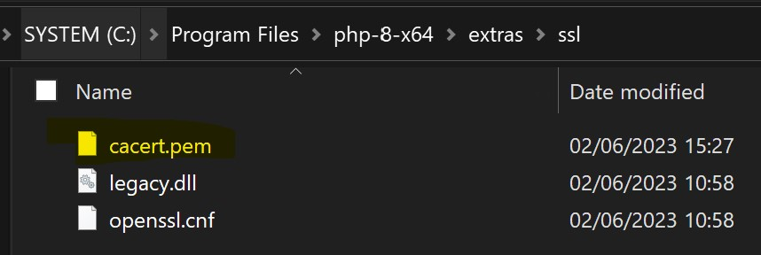
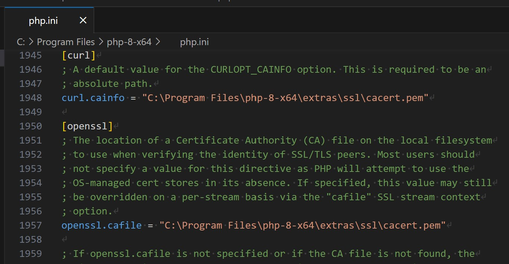
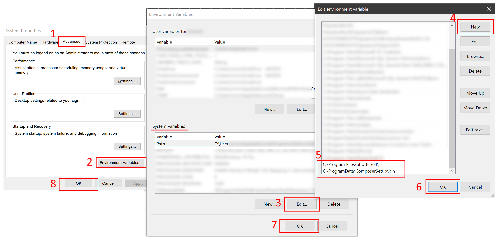

# Simple MS Graph PHP SDK for Upload file in SharePoint

## Installation (Example on Windows)

1) Download PHP for Windows:
[https://windows.php.net/downloads/releases/php-8.2.6-Win32-vs16-x64.zip](https://windows.php.net/downloads/releases/php-8.2.6-Win32-vs16-x64.zip)

2) Unzip in your Program Files folder:
(Unblock the zip before unzipping. Right Click, "Properties" to unblock)

    `C:\Program Files\php-8-x64\`

3) Download the `cacert.pem` and save it in your PHP installation folder, ssl folder:
   [https://curl.se/docs/caextract.html](https://curl.se/docs/caextract.html)

   `C:\Program Files\php-8-x64\extras\ssl`

    
    Add the following settings (change acording to your settings) in your php.ini (`C:\Program Files\php-8-x64\php.ini`)  

    ```ini
    curl.cainfo = "C:\Program Files\php-8-x64\extras\ssl\cacert.pem"
    openssl.cafile = "C:\Program Files\php-8-x64\extras\ssl\cacert.pem"
    ```

    

4) Add the PHP installation folder into your PATH Environment Variables


5) Install PHP Composer with Windows Installer:
   [https://getcomposer.org/download/](https://getcomposer.org/download/)

   It will detect your PHP installation and add the proper Environment Variables for you. If not, you can add as describe on the previous step

## Post Installation

1) Launch Visual Studio Code, in the terminal, run the following command for installing all dependencies:

    ```powershell
    $>cd .\uploadFile_to_sp\
    $>composer update
    ```

## How to create Azure App Registration

(Need admin rights on Azure AD)

1) Go to the Azure Active Directory portal:
[Azure AD Portal](https://portal.azure.com/#view/Microsoft_AAD_IAM/ActiveDirectoryMenuBlade/~/Overview)

### Create the "SharePoint access Granter" Application Registration (Application Client ID)

1) Click Add > App registration
2) Name: SharePoint access granter  
3) Supported account types: Accounts in this organizational directory only (TENANT_NAME only - Single tenant)
4) Redirect URI (Optional): Select "Web" platform and keep the input text tempty
5) Click "Register"
6) After the Application Registration has been created, mark down:
   1) Application (client) ID
   2) Directory (tenant) ID
7) Go to the "API Permissions" menu and click "Add a permission"
8) Select "Microsoft Graph"
9) Select "Application permissions"
10) Search for "Sites.FullControl.All" and Add that permission
11) Repeat steps 7 to 10 but select "SharePoint" on step 8 instead of "Microsoft Graph"
12) After adding these 2 permissions, you can "Grant admin consent for TENANT_NAME" otherwise it won't work
13) You can remove the permission "User.Read"
14) Create the Application Client ID Secret through the (side) menu "Certificates & secrets"
15) Select the tab "Client secrets"
16) Click "New client secret"
17) Add a description like "secret for granter"
18) Expires: pick a period and click "Add"
19) Mark down the secret value

**Important**: We will only use that Application (Client ID) registration for authorizing the second Application Client ID (below) to access to a specific SharePoint site as we do not want to provide FullControl to the SharePoint SiteCollection

### Create the "Application SharePoint uploader access" Application Registration (Application Client ID)

Same steps like "Create the "Application SharePoint uploader access" Application Registration (Application Client ID)" except that you need to pick the API permission "Sites.Selected" instead of "Sites.FullControl.All":

1) Click Add > App registration
2) Name: Application SharePoint uploader access
3) Supported account types: Accounts in this organizational directory only (TENANT_NAME only - Single tenant)
4) Redirect URI (Optional): Select "Web" platform and keep the input text tempty
5) Click "Register"
6) After the Application Registration has been created, mark down:
   1) Application (client) ID
   2) Directory (tenant) ID
7) Go to the "API Permissions" menu and click "Add a permission"
8) Select "Microsoft Graph"
9) Select "Application permissions"
10) Search for "Sites.Selected" and Add that permission
11) Repeat steps 7 to 10 but select "SharePoint" on step 8 instead of "Microsoft Graph"
12) After adding these 2 permissions, you can "Grant admin consent for TENANT_NAME" otherwise it won't work
13) You can remove the permission "User.Read"
14) Create the Application Client ID Secret through the (side) menu "Certificates & secrets"
15) Select the tab "Client secrets"
16) Click "New client secret"
17) Add a description like "secret for app sharepoint uploader"
18) Expires: pick a period and click "Add"
19) Mark down the secret value and add it in the ".env" file

### Retrieve your SharePoint Site ID

1) Go to your SharePoint website home page URL where you want to upload your files

    Example: https://SHAREPOINT_NAME/sites/MySP

2) Add the following text to the URL "/_api/site/id". The final URL will look like this:

    Example: https://SHAREPOINT_NAME/sites/MySP/_api/site/id

3) Mark down your SharePoint "Site ID"  from the XML output and add it in the ".env" file

### Provide "Write Access" to "Application SharePoint uploader access" Application (client) ID

1) Fill the file ".env.granter" using the information created from the step "SharePoint access Granter" and "SharePoint Site ID"
2) Run the PHP script "granter_appid_to_sharepoint.php"
3) Your Application Client ID dedicated for uploading file in SharePoint is now allowed to upload (write) file in the SharePoint Site ID (Document Library) specified in your ".env.granter". You can go to the next step

### Upload a file in SharePoint

1) Fill the file ".env" using the information created from the step "Application SharePoint uploader access" and "SharePoint Site ID"
2) Edit the PHP variable named "$file_fullpath_to_upload" (line ~13) in the PHP script "upload_file_to_sharepoint.php" to specify the file that you want to upload
3) Run the PHP script "upload_file_to_sharepoint.php"
4) You will see your uploaded file in the SharePoint

Note: The script will automatically generate the folder tree structure from the SharePoint Document Library root folder. Please check the PHP script "upload_file_to_sharepoint.php" for more details ("$new_folder_path" and "$new_folder_name" line ~51)

### Verify that your file has been uploaded in SharePoint

1) Edit the script `list_files_from_sharepoint.php` to change the variable `$folder_to_list` value according to the folder that you want to list the content
2) Run the script `list_files_from_sharepoint.php`
3) You will see all the folders / files from your the value specify in the variable `$folder_to_list`

